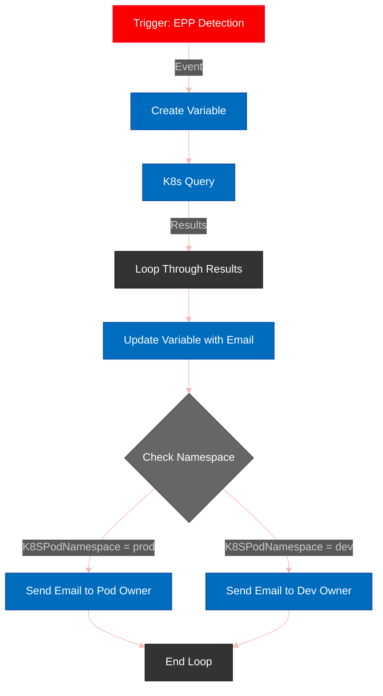

# EPP Podname Detection Workflow

<div align="center">
  
  <h3>Kubernetes Security Automation</h3>
</div>

## Overview
This workflow demonstrates automated incident response for Kubernetes environments monitored by CrowdStrike Endpoint Protection Platform (EPP). The automation performs the following functions:

1. 🔍 Detects EPP security alerts within Kubernetes clusters
2. 🔎 Identifies the affected pod and its namespace
3. 📧 Retrieves relevant contact information from K8s emailAddress annotations
4. 🚨 Routes notifications to appropriate stakeholders based on environment classification (production/development)

## Requirements
- CrowdStrike Falcon XDR/SOAR platform with workflow capabilities
- Kubernetes namespaces with proper email annotations
- Access to create and manage Kubernetes resources

## Namespace Setup
To enable proper email routing, each namespace must be annotated with an email address:

```bash
# Create production namespace
kubectl create namespace prod
kubectl annotate namespace prod emailaddress="you@yourdomain.com"

# Create development namespace
kubectl create namespace dev
kubectl annotate namespace dev emailaddress="you@yourdomain.com"
```

These annotations are critical as the workflow queries them to determine notification recipients.

## Workflow Process

<table>
  <tr>
    <th>Step</th>
    <th>Action</th>
    <th>Description</th>
  </tr>
  <tr>
    <td>1</td>
    <td>Trigger</td>
    <td>Activates on EPP detection events</td>
  </tr>
  <tr>
    <td>2</td>
    <td>Variable Creation</td>
    <td>Establishes storage for email information</td>
  </tr>
  <tr>
    <td>3</td>
    <td>K8s Query</td>
    <td>Retrieves Kubernetes data related to the detection</td>
  </tr>
  <tr>
    <td>4</td>
    <td>Variable Update</td>
    <td>Populates variables with retrieved information</td>
  </tr>
  <tr>
    <td>5</td>
    <td>Environment Evaluation</td>
    <td>Determines pod namespace environment (prod vs dev)</td>
  </tr>
  <tr>
    <td>6</td>
    <td>Notification</td>
    <td>Sends targeted alerts to appropriate recipients</td>
  </tr>
</table>

## Key Features
- **Environment-specific notifications**: Different handling for production vs development alerts
- **Dynamic data retrieval**: Automatically pulls pod name and namespace information
- **Contact discovery**: Fetches email addresses from namespace metadata
- **Rich context**: Includes detection URL and relevant details in notifications

## Workflow Diagram



## Technical Notes
- The workflow uses a Kubernetes query to correlate EPP detections with pod information
- Email notifications contain the pod name, namespace, and a link to the detection
- Different email templates are used for production vs development environments
- Contact information is dynamically retrieved from namespace metadata via the `emailaddress` annotation
- Ensure all namespaces have the proper annotation to prevent notification failures

## Environment-Specific Actions

<table>
  <tr>
    <th style="background-color: #FC0000; color: white;">Production</th>
    <th style="background-color: #006CBE; color: white;">Development</th>
  </tr>
  <tr>
    <td>High-priority alerts to pod owners</td>
    <td>Standard alerts to development team</td>
  </tr>
  <tr>
    <td>Immediate notification</td>
    <td>Consolidated notification</td>
  </tr>
  <tr>
    <td>Includes detailed remediation steps</td>
    <td>Includes investigation guidance</td>
  </tr>
</table>

## Integration Capabilities
The workflow can be extended to integrate with various notification channels:

- **Chat Platforms**: Microsoft Teams, Slack
- **ITSM Systems**: ServiceNow, Jira
- **Alert Management**: PagerDuty, OpsGenie
- **Custom Webhooks**: For integration with proprietary systems

## Getting Started
1. Import the workflow YAML into your CrowdStrike Falcon instance
2. Configure Kubernetes namespaces with appropriate email annotations
3. Test the workflow with a simulated detection
4. Monitor and adjust notification settings as needed

---

<div align="center">
  <p><i>Made with ❤️ for the CrowdStrike Community</i></p>
</div>
