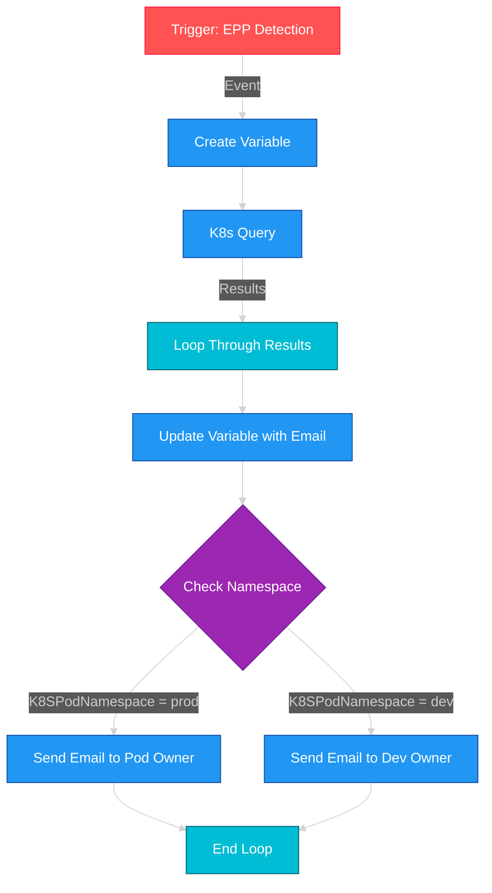

# EPP Podname Detection Workflow

## Overview
This workflow automates the detection and notification process for CrowdStrike Endpoint Protection Platform (EPP) alerts in Kubernetes environments. When an EPP detection is triggered, the workflow identifies the affected Kubernetes pod, determines its namespace, and sends appropriate email notifications based on the environment (production or development) and K8s annotations.

## Requirements
1. 🔐 CrowdStrike XDR/SOAR platform with workflow capabilities
2. 🔖 Kubernetes namespaces with proper email annotations
3. 🔑 Access to create and manage Kubernetes resources

## Namespace Setup
To enable proper email routing, each namespace must be annotated with an email address:

```bash
# Create production namespace
kubectl create namespace prod
kubectl annotate namespace prod emailaddress="you@yourdomain.com"

# Create development namespace
kubectl create namespace dev
kubectl annotate namespace dev emailaddress="you@yourdomain.com"
```

These annotations are critical as the workflow queries them to determine notification recipients.

## Workflow Process
1. 🚨 Triggers on EPP detection events
2. 📝 Creates a variable to store email information
3. 🔍 Queries Kubernetes data related to the detection
4. 🔄 Updates variables with retrieved information
5. 🧐 Evaluates the pod namespace environment (prod vs dev)
6. 📧 Sends targeted email notifications to appropriate recipients

## Key Features
- 🔴 Environment-specific notifications (prod vs dev)
- 🟢 Retrieves pod name and namespace information
- 🔵 Dynamically fetches contact email from namespace metadata
- 🟣 Includes detection URL in notifications

## Diagram



## Notes
- 🔎 The workflow uses a Kubernetes query to correlate EPP detections with pod information
- 📨 Email notifications contain the pod name, namespace, and a link to the detection
- 🔀 Different email templates are used for production vs development environments
- 📋 Contact information is dynamically retrieved from namespace metadata via the `emailaddress` annotation
- ⚠️ Ensure all namespaces have the proper annotation to prevent notification failures

## Environment-Specific Actions
- 🏭 **Production**: Alerts sent to designated pod owners with high priority
- 🧪 **Development**: Alerts sent to development team owners for investigation

---

*Made with ❤️ for the CrowdStrike Community*
